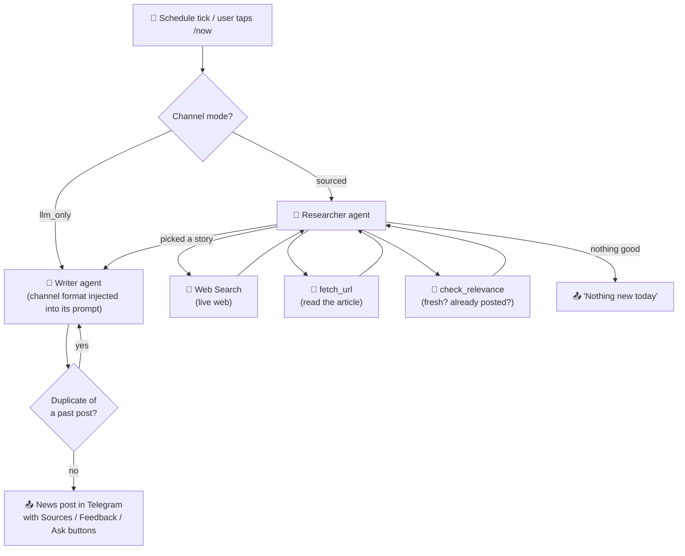
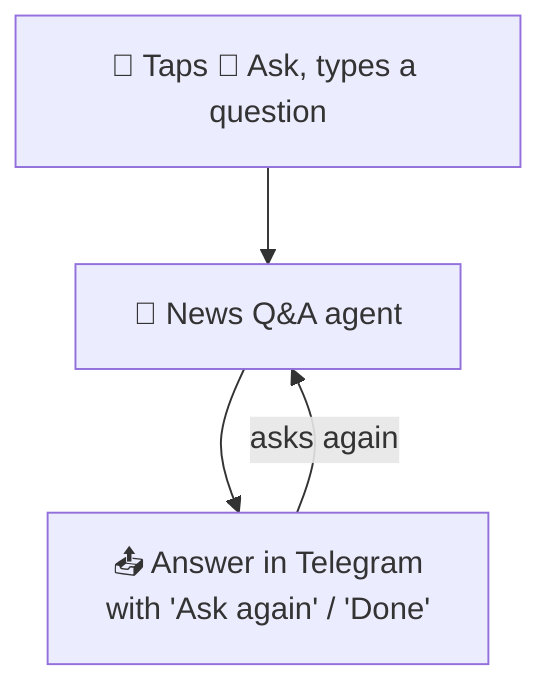
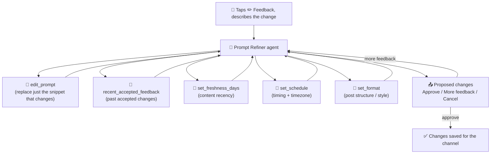
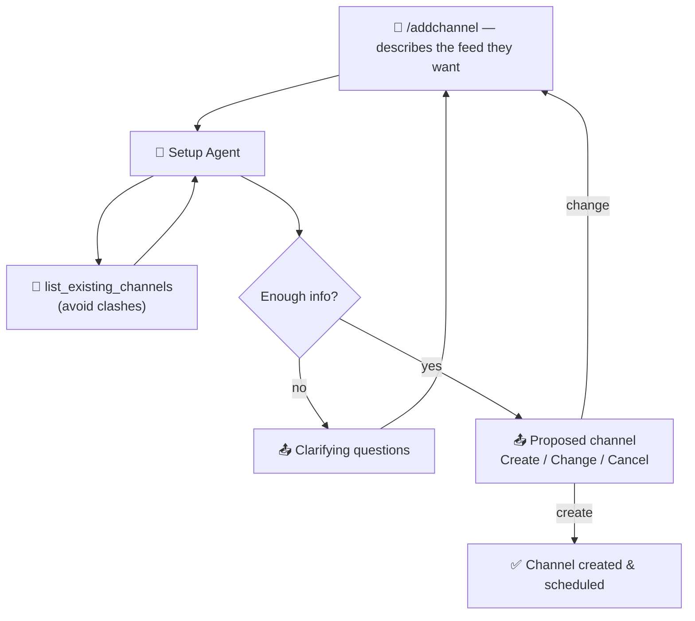
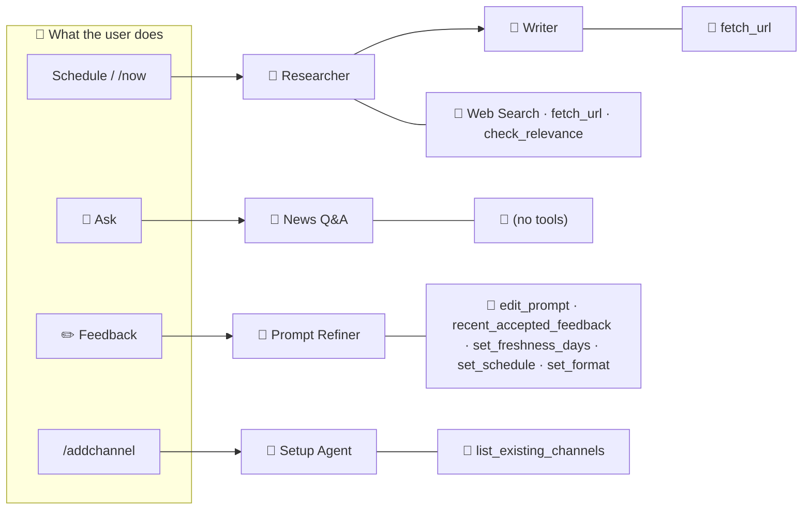

# Agentic Flow — User Journeys

How real user actions flow through the agents and the tools each agent uses.
Read each diagram top‑to‑bottom: **user action → agent (LLM call) → tools → result back to the user.**

Legend:
- 🧑 user action / Telegram tap
- 🤖 agent (an LLM call)
- 🔧 tool the agent can call
- 📤 what the user gets back

---

## Journey 1 — "Give me the news" (post a new item)

Triggered by the schedule firing, or the user tapping **/now**.
For a `sourced` channel the **Researcher** finds a story, then the **Writer** turns it into a post.

---

## Journey 2 — "I have a question about this post" (Ask)

User taps **💬 Ask** under a post and types a question.
The **News Q&A** agent answers using the post + the running conversation. No tools — it just answers.

---

## Journey 3 — "Change what this channel posts" (Feedback)

User taps **✏️ Feedback** and says what to change.
The **Prompt Refiner** edits the channel's prompt in place (snippet by snippet,
not a full rewrite) and can also change deterministic settings — content
freshness, the posting schedule (timing + timezone), and the per-channel
format — then shows the result for approval. The current prompt, schedule,
format and session history are already in its instructions, so it doesn't
spend tool calls fetching them.

---

## Journey 4 — "Set up a new channel" (/addchannel or edit)

User runs **/addchannel** (or edits a channel) and describes, in plain words, what they want.
The **Setup Agent** asks clarifying questions and proposes a full channel spec.

---

## All agents at a glance

> Behind the scenes, both the Researcher's **check_relevance** tool and the
> Writer's duplicate check call an **embedding model** (`text-embedding-3-small`)
> to tell whether a story was already posted. It runs automatically — the user
> never triggers it directly.
